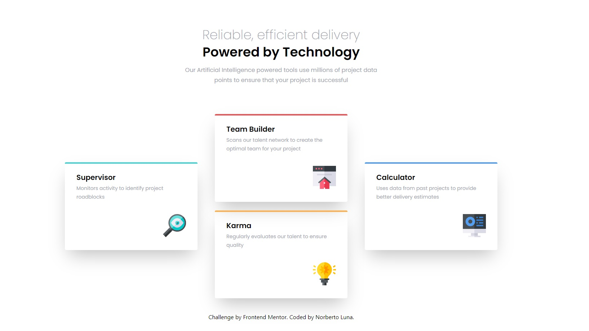

# Frontend Mentor - Four card feature section solution

This is a solution to the [Four card feature section challenge on Frontend Mentor](https://www.frontendmentor.io/challenges/four-card-feature-section-weK1eFYK).

## Table of contents

- [Overview](#overview)
  - [The challenge](#the-challenge)
  - [Screenshot](#screenshot)
  - [Links](#links)
- [My process](#my-process)
  - [Built with](#built-with)
  - [Useful resources](#useful-resources)
- [Author](#author)

## Overview

### The challenge

Users should be able to:

- View the optimal layout for the site depending on their device's screen size

### Screenshot

**Note: Delete this note and the paragraphs above when you add your screenshot. If you prefer not to add a screenshot, feel free to remove this entire section.**

### Links

- Solution URL: [Solution URL](https://github.com/Grathienbeto/four-card)
- Live Site URL: [Live site URL ]()

## My process

### Built with

- Flexbox
- Mobile-first workflow
- [Tailwind](https://tailwindcss.com/) - CSS Library

## Author

- Frontend Mentor - [@Grathienbeto](https://www.frontendmentor.io/profile/Grathienbeto)
- Twitter - [@betoluna89](https://twitter.com/betoluna89)
